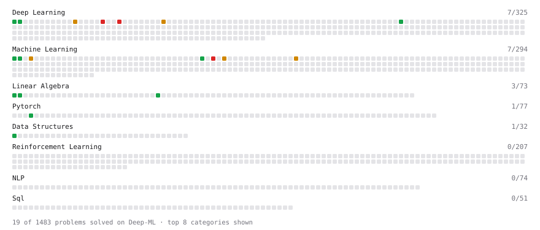

# Deep-ML

My machine learning practice from [Deep-ML](https://www.deep-ml.com). Every solution here was written by hand.

**19** solved · 19 problems · 0 labs · 0 math

[**Browse the interactive portfolio**](https://SATYAJIT2747.github.io/deep-ml/) to replay this filling in over time.

## Problems

| | Difficulty | Solved | |
| --- | --- | --- | --- |
| [Binary Classification with Logistic Regression](https://www.deep-ml.com/problems/104) | easy | 2026-09-14 | [solution](problems/0104-binary-classification-with-logistic-regression) |
| [Calculate Cosine Similarity Between Vectors](https://www.deep-ml.com/problems/76) | easy | 2026-09-12 | [solution](problems/0076-calculate-cosine-similarity-between-vectors) |
| [Implement a Linear Layer Forward Pass with Matrix Multiplication](https://www.deep-ml.com/problems/883) | easy | 2026-09-20 | [solution](problems/0883-implement-a-linear-layer-forward-pass-with-matrix-multiplication) |
| [Implement Binary Cross-Entropy Loss](https://www.deep-ml.com/problems/263) | easy | 2026-09-14 | [solution](problems/0263-implement-binary-cross-entropy-loss) |
| [Linear Regression Using Gradient Descent](https://www.deep-ml.com/problems/15) | easy | 2026-09-13 | [solution](problems/0015-linear-regression-using-gradient-descent) |
| [Linear Regression Using Normal Equation](https://www.deep-ml.com/problems/14) | easy | 2026-09-13 | [solution](problems/0014-linear-regression-using-normal-equation) |
| [Matrix-Vector Dot Product](https://www.deep-ml.com/problems/1) | easy | 2026-09-12 | [solution](problems/0001-matrix-vector-dot-product) |
| [Min-Max Scaling of Feature Values](https://www.deep-ml.com/problems/112) | easy | 2026-09-12 | [solution](problems/0112-min-max-scaling-of-feature-values) |
| [Sigmoid Activation Function Understanding](https://www.deep-ml.com/problems/22) | easy | 2026-09-13 | [solution](problems/0022-sigmoid-activation-function-understanding) |
| [Softmax Activation Function Implementation ](https://www.deep-ml.com/problems/23) | easy | 2026-09-20 | [solution](problems/0023-softmax-activation-function-implementation) |
| [Transpose of a Matrix](https://www.deep-ml.com/problems/2) | easy | 2026-09-12 | [solution](problems/0002-transpose-of-a-matrix) |
| [Implement K-Nearest Neighbors](https://www.deep-ml.com/problems/173) | medium | 2026-09-15 | [solution](problems/0173-implement-k-nearest-neighbors) |
| [Implement Layer Normalization for Sequence Data](https://www.deep-ml.com/problems/109) | medium | 2026-09-30 | [solution](problems/0109-implement-layer-normalization-for-sequence-data) |
| [Implement Masked Self-Attention](https://www.deep-ml.com/problems/107) | medium | 2026-09-30 | [solution](problems/0107-implement-masked-self-attention) |
| [Implement Self-Attention Mechanism](https://www.deep-ml.com/problems/53) | medium | 2026-09-30 | [solution](problems/0053-implement-self-attention-mechanism) |
| [K-Means Clustering](https://www.deep-ml.com/problems/17) | medium | 2026-09-15 | [solution](problems/0017-k-means-clustering) |
| [Implement Multi-Head Attention](https://www.deep-ml.com/problems/94) | hard | 2026-09-30 | [solution](problems/0094-implement-multi-head-attention) |
| [Positional Encoding Calculator](https://www.deep-ml.com/problems/85) | hard | 2026-09-30 | [solution](problems/0085-positional-encoding-calculator) |
| [Train Logistic Regression with Gradient Descent](https://www.deep-ml.com/problems/106) | hard | 2026-09-14 | [solution](problems/0106-train-logistic-regression-with-gradient-descent) |

---

_This file is regenerated by Deep-ML on every push._
